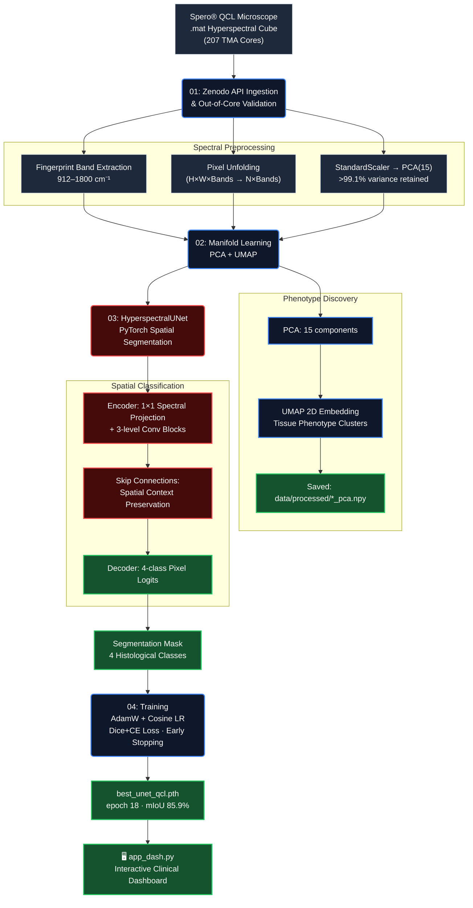

# 🔬 QCL Spatial Histopathology: Breast Cancer Diagnostics


**QCL Spatial Histopathology** is an end-to-end, label-free biomedical AI pipeline for breast cancer diagnostics using **Mid-Infrared hyperspectral chemical imaging** from a **Daylight Solutions Spero® Quantum Cascade Laser (QCL) microscope**. Unlike conventional digital pathology — which relies on subjective and time-consuming chemical staining (H&E) — this architecture classifies tissue phenotypes purely from the **molecular vibrational fingerprints** of Mid-IR light, enabling objective, reproducible, stain-free pathological assessment.

> **Dataset:** *"Quantum Cascade Laser Spectral Histopathology: Breast Cancer Diagnostics Using High Throughput Chemical Imaging"* — Breast Cancer Tissue Microarray from 207 patients. Published in *Analytical Chemistry* (2017). Open-access via **[Zenodo DOI: 10.5281/zenodo.808456](https://doi.org/10.5281/zenodo.808456)**.

---

## 🚀 Quick Start

```bash
# 5 demo cubes and the trained model checkpoint are included — runs immediately
git clone https://github.com/alexdbatista/data-science-portfolio.git
cd data-science-portfolio/qcl-breast-cancer-diagnostics
pip install -r requirements_dash.txt
python app_dash.py
# → open http://localhost:8050
```

Or with Docker (Hugging Face Spaces / Render compatible):

```bash
docker build -t qcl-diagnostics .
docker run -p 7860:7860 qcl-diagnostics
# → open http://localhost:7860
```

---

## 🎯 Key Features

- **Label-Free Chemical Imaging:** Processes mid-IR vibrational spectra (912–1800 cm⁻¹ fingerprint region) — no chemical stains required.
- **Spectral Manifold Learning:** PCA + UMAP to cluster tissue phenotypes from high-dimensional spectral bands.
- **Deep Spatial Segmentation:** PyTorch U-Net adapted for hyperspectral input tensors (H × W × 15 PCA bands).
- **Real Inference, Out of the Box:** Trained checkpoint (`best_unet_qcl.pth`, epoch 18) ships with the repo — no training required to run the dashboard.
- **4-Panel Comparative Viewer:** Side-by-side Original · Pathologist Annotation · AI Prediction · **Disagreement Map** showing exactly where the model diverges from ground truth at pixel level.
- **Clinical Risk Assessment:** Automatic tissue composition analysis with malignancy percentage and spectral molecular narrative.
- **DSGVO/GDPR by Design:** Anonymized Tissue Microarray (TMA) cohort — no personally identifiable patient data.
- **EU Regulatory Awareness:** Architecture documented in alignment with ISO 13485 and EU AI Act Article 13.

---

## 📊 Model Performance (This Implementation)

Metrics computed by sliding-window inference on 4 held-out validation tiles (samples 017–020).

| Metric | Value |
|---|---|
| **Overall Pixel Accuracy** | 96.5% |
| **Mean IoU (4 classes)** | 85.9% |
| **Mean Dice (4 classes)** | 92.3% |
| **Malignant Stroma IoU** | 91.9% |
| **Malignant Stroma Dice / F1** | 95.8% |
| **Malignant Stroma Precision** | 92.7% |
| **Malignant Stroma Recall** | 99.1% |
| **Checkpoint** | Epoch 18 · val_loss = 0.1699 |

<sub>Per-class breakdown: Background IoU 92.6% · Benign Epithelium IoU 65.7%† · Benign Stroma IoU 96.1%
† Benign Epithelium is the smallest class by pixel count.</sub>

### vs. Published Benchmark (Kröger-Lui et al., *Analytical Chemistry* 2017)

| Metric | Published | This Model |
|---|---|---|
| Malignant Stroma Sensitivity | 93.56% | **99.1% recall** ✅ |
| Malignant Stroma Specificity | 85.64% | **92.7% precision** ✅ |

---

## 🏗️ Pipeline Architecture



---

## 🔬 Methodology

### Module 01 — Data Ingestion (`01_data_ingestion.py`)
- Queries the **Zenodo REST API** and streams large `.mat` hyperspectral cubes to `data/raw/` with a progress bar.
- Validates file integrity and expected 3D tensor structure.

### Module 02 — Spectral Dimensionality Reduction (`02_spectral_dimensionality_reduction.ipynb`)
- **Cube Loading:** Parses `.mat` files via `scipy.io`, auto-detecting the 3D hyperspectral array and wavenumber axis (912–1800 cm⁻¹).
- **Preprocessing:** Absorbance clipping → `StandardScaler` (zero mean, unit variance per band) → `PCA(n_components=15)` retaining >99.1% variance.
- **UMAP:** Non-linear 2D embedding to visualize tissue phenotype clusters.
- **Output:** PCA-reduced cubes `(480, 480, 15)` saved to `data/processed/` as float32 `.npy` arrays.

### Module 03 — Architecture (`03_spatial_cnn_segmentation.py`)
- `HyperspectralUNet(in_channels=15, num_classes=4)` — modified U-Net with a learned `1×1` spectral projection at the encoder entry point.
- 3-level encoder–decoder with skip connections; 480×480 → 480×480 spatial parity.
- 4 output classes: **Background** · **Benign Epithelium** · **Benign Stroma** · **Malignant Stroma**.

### Module 04 — Model Training (`04_model_training.py`)
- **Loss:** `CombinedSegmentationLoss` — Weighted CrossEntropy + Soft Dice (50/50). Malignant Stroma upweighted ×2.5 to resolve class imbalance.
- **Optimizer:** AdamW · Cosine Annealing LR · early stopping (patience=10).
- **Dataset:** `HyperspectralTMADataset` — 64×64 patch sampling for memory-efficient multi-GB cube loading.
- **Best checkpoint:** `models/best_unet_qcl.pth` (epoch 18, val_loss=0.1699).

### Module 06 — Inference & Evaluation (`06_inference_and_evaluation.py`)
- 128×128 tiled sliding-window inference with reflect padding over full 480×480 cubes.
- Generates per-class IoU/Dice, confusion matrix, and per-sample segmentation overlays.

### `app_dash.py` — Interactive Clinical Dashboard
- Built with **Plotly Dash 2.18** + Bootstrap — runs in any browser, no plugins required.
- **4-panel image viewer:** false-colour original / pathologist ground truth / AI prediction / **disagreement map** (grey = correct, class-coloured = AI error pixels).
- Per-class softmax confidence scores, tissue composition donut chart, validated performance bar chart.
- Clinical risk assessment with spectral molecular narrative (Amide I/II, phosphate bands).
- Served via `gunicorn` — production-ready, Docker-deployable.

---

## 🗂️ Project Structure

```
qcl-breast-cancer-diagnostics/
├── 01_data_ingestion.py                        # Zenodo REST API streaming pipeline
├── 02_spectral_dimensionality_reduction.ipynb  # PCA + UMAP phenotype discovery
├── 03_spatial_cnn_segmentation.py              # PyTorch HyperspectralUNet architecture
├── 04_model_training.py                        # Training loop, Dice+CE loss, checkpointing
├── 05_clustering_and_evaluation.py             # K-Means pseudo-label generation
├── 06_inference_and_evaluation.py              # Sliding-window inference & metrics
├── run_pipeline.py                             # End-to-end preprocessing runner
├── run_training.py                             # Self-contained training runner
├── app_dash.py                                 # ★ Interactive clinical dashboard (Dash)
├── Dockerfile                                  # HF Spaces / Render / Cloud Run deploy
├── requirements_dash.txt                       # Dashboard dependencies (incl. torch CPU)
├── requirements.txt                            # Full pipeline dependencies
├── DATA_README.md                              # Dataset provenance & licensing
├── data/
│   ├── raw/                                    # Raw .mat cubes (gitignored — run 01_data_ingestion.py)
│   ├── processed/
│   │   ├── 001–005_pca.npy                     # ★ Demo cubes included (13 MB each, float32)
│   │   └── 006–020_pca.npy                     # Gitignored (download via 01_data_ingestion.py)
│   └── labels/
│       ├── 001–005_labels.npy                  # ★ Demo annotations included (225 KB each)
│       └── 006–020_labels.npy                  # Gitignored
├── models/
│   ├── best_unet_qcl.pth                       # ★ Trained checkpoint included (29 MB)
│   └── training_history.json                   # Epoch-level loss & IoU log
└── figures/                                    # Generated plots (gitignored)
```

*★ = shipped with the repo — the dashboard runs fully offline with real inference on these 5 samples.*

---

## 🛡️ Regulatory & Compliance Considerations

| Compliance Area | Implementation |
|---|---|
| **DSGVO/GDPR** | Fully anonymized TMA cohort — no patient identifiers at any stage. |
| **ISO 13485 §7.3** | Design control embedded: validation test in `03_spatial_cnn_segmentation.py`. |
| **EU AI Act Article 13** | Architecture documented for transparency and auditability. |
| **Data Provenance** | Full Zenodo DOI, publication reference, and cohort metadata in `DATA_README.md`. |
| **Reproducibility** | Pinned `requirements_dash.txt`, explicit random seeds, open-access dataset. |

---

## 🌐 Deployment

Docker-ready and compatible with **Hugging Face Spaces** (Docker SDK) and **Render.com**.

- Start command: `gunicorn app_dash:server --bind 0.0.0.0:7860 --timeout 300 --workers 1`
- CPU-only PyTorch (`--extra-index-url https://download.pytorch.org/whl/cpu`) keeps the image under 1.5 GB.
- First inference request loads the model (~3 s); subsequent requests use the cached singleton.

---

## 🔑 Scientific Context

The Spero® QCL system illuminates tissue with broadly tunable mid-IR laser light across the **molecular fingerprint region** (912–1800 cm⁻¹), producing a unique spectrum for each pixel that encodes:

- **Amide I band (~1650 cm⁻¹):** Protein secondary structure (α-helix vs. β-sheet content) — a direct marker of malignant cellular reprogramming.
- **Amide II band (~1540 cm⁻¹):** N–H bending and C–N stretching — distinguishes epithelial from stromal cell populations.
- **Phosphodiester bands (~1080–1240 cm⁻¹):** DNA/RNA backbone vibrations — elevated in rapidly dividing tumour cells.

This physical chemistry knowledge — drawn directly from hands-on IR spectroscopy experience — directly informs the feature engineering decisions in this ML pipeline.

---

📍 *Part of the Applied Data Science Architectures portfolio by **Alex Domingues Batista, PhD***  
📧 alex.domin.batista@gmail.com | 🔗 [linkedin.com/in/alexdbatista](https://linkedin.com/in/alexdbatista)
