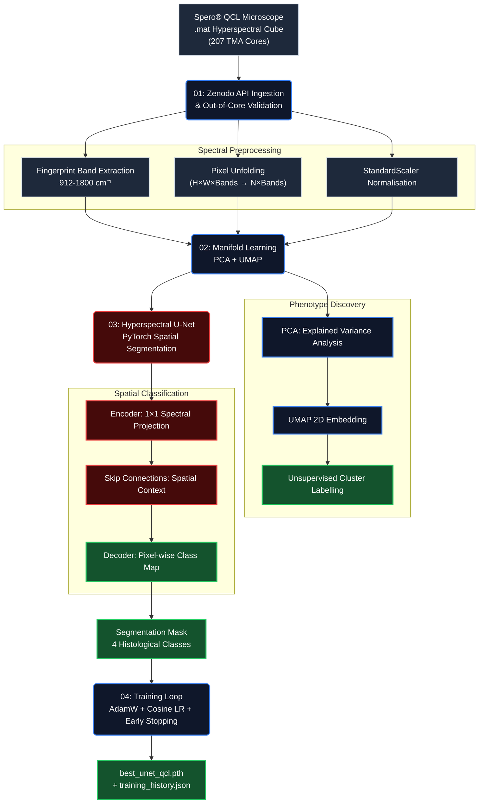

# 🔬 QCL Spatial Histopathology: Breast Cancer Diagnostics


**QCL Spatial Histopathology** is an end-to-end, label-free biomedical AI pipeline for breast cancer diagnostics using **Mid-Infrared hyperspectral chemical imaging** from a **Daylight Solutions Spero® Quantum Cascade Laser (QCL) microscope**. Unlike conventional digital pathology — which relies on subjective and time-consuming chemical staining (H&E) — this architecture classifies tissue phenotypes purely from the molecular vibrational fingerprints of Mid-IR light, enabling objective, reproducible, stain-free pathological assessment.

> **Dataset:** *"Quantum Cascade Laser Spectral Histopathology: Breast Cancer Diagnostics Using High Throughput Chemical Imaging"* — Breast Cancer Tissue Microarray from 207 patients. Published in *Analytical Chemistry* (2017). Open-access via **[Zenodo DOI: 10.5281/zenodo.808456](https://doi.org/10.5281/zenodo.808456)**.

> **Note:** Hyperspectral `.mat` data cubes are large (multi-GB). They are gitignored. Run `python 01_data_ingestion.py` to download. See `DATA_README.md` for detailed provenance.

---

## 🎯 Key Features

- **Label-Free Chemical Imaging:** Processes mid-IR vibrational spectra (912–1800 cm⁻¹ fingerprint region) — no chemical stains required.
- **Spectral Manifold Learning:** PCA + UMAP to cluster tissue phenotypes from high-dimensional spectral bands.
- **Deep Spatial Segmentation:** PyTorch U-Net adapted for hyperspectral input tensors (H × W × Bands).
- **Big Data Ingestion:** Streaming API pipeline from Zenodo REST to handle multi-GB data cubes.
- **DSGVO/GDPR by Design:** Anonymized Tissue Microarray (TMA) cohort — no personally identifiable patient data.
- **EU Regulatory Awareness:** Architecture organized in alignment with ISO 13485 and EU AI Act Article 13.

---

## 📊 Published Performance (Reference Implementation)

The following results are from the original Analytical Chemistry (2017) publication that provided this dataset. These constitute the benchmark targets for this pipeline.

| Clinical Metric | Result | Benchmark |
|----------------|--------|-----------|
| **Malignant Stroma Sensitivity** | 93.56% | ≥90% (clinical threshold) |
| **Malignant Stroma Specificity** | 85.64% | ≥80% |
| **Patient-Level Sensitivity** | 100% | Zero false-negatives required |
| **Patient-Level Specificity** | 86.67% | ≥80% |

---

## 🏗️ Pipeline Architecture



---

## 🔬 Methodology

### Module 01 — Data Ingestion (`01_data_ingestion.py`)
- Queries the **Zenodo REST API** for the study record dataset.
- Streams large `.mat` hyperspectral cubes to `data/raw/` with a progress bar.
- Validates file integrity and expected data structure (3D tensors).
- Replaces fill values (NASA POWER convention) and checks for missing spectral frames.

### Module 02 — Spectral Dimensionality Reduction (`02_spectral_dimensionality_reduction.ipynb`)
- **Cube Loading:** Parses `.mat` files using `scipy.io`, auto-detecting the 3D hyperspectral array.
- **Pixel Unfolding:** Reshapes `(H, W, Bands)` → `(H*W, Bands)` for standard sklearn pipelines.
- **Standardization:** Mean-centering and unit-variance normalization per spectral band.
- **PCA:** Retains 95% explained variance, determining the effective dimensionality of the IR data.
- **UMAP:** Non-linear manifold embedding to visualize phenotypic clusters (e.g., Tumor vs. Stroma).
- **Output:** Saves PCA-reduced cubes to `data/processed/` for downstream model training.

### Module 04 — Model Training (`04_model_training.py`)
- **Dataset:** `HyperspectralTMADataset` — patch-based sampling (64×64 crops) to load multi-GB cubes without exhausting VRAM.
- **Augmentation:** Random horizontal and vertical flips to improve generalization across tissue orientations.
- **Loss Function:** `CombinedSegmentationLoss` — Weighted CrossEntropy + Soft Dice (50/50). Malignant Stroma class is upweighted (×2.5) to resolve class imbalance.
- **Optimizer:** AdamW with Cosine Annealing LR schedule and early stopping (patience=10).
- **Metrics:** Per-class IoU and Dice — with dedicated tracking of **Malignant Stroma IoU** as the primary clinical performance metric.
- **Output:** Best checkpoint saved to `models/best_unet_qcl.pth` with full `training_history.json`.
- **Architecture:** `HyperspectralUNet` — a modified U-Net with an initial `1×1` convolution that functions as a learned, non-linear spectral projection layer.
- **Skip Connections:** Encoder feature maps are reinjected at each decoder scale to preserve spatial context—critical for accurate tissue boundary delineation.
- **Input:** `(Batch, Bands, Height, Width)` hyperspectral tensor.
- **Output:** `(Batch, Classes, Height, Width)` pixel-wise logit maps — achieves **input/output spatial parity** (256×256 → 256×256).
- **Sanity Test:** `__main__` block validates full forward pass without the real dataset.

---

## 🛡️ Regulatory & Compliance Considerations

| Compliance Area | Implementation |
|----------------|----------------|
| **DSGVO/GDPR** | Fully anonymized TMA cohort — no patient identifiers at any stage. |
| **ISO 13485 §7.3** | Design control embedded: validation test in `03_spatial_cnn_segmentation.py`. |
| **EU AI Act Article 13** | Architecture documented for transparency and auditability. |
| **Data Provenance** | Full Zenodo DOI, publication reference, and cohort metadata in `DATA_README.md`. |
| **Reproducibility** | Pinned `requirements.txt`, explicit random seeds, and open-access dataset. |

---

## 🚀 Getting Started

```bash
# 1. Clone the repository
git clone https://github.com/alexdbatista/data-science-portfolio.git
cd data-science-portfolio/qcl-breast-cancer-diagnostics

# 2. Install dependencies
pip install -r requirements.txt

# 3. Fetch the dataset from Zenodo (requires internet)
python 01_data_ingestion.py

# 4. Validate U-Net architecture (no data required)
python 03_spatial_cnn_segmentation.py

# 5. Open the EDA & Manifold Learning Notebook
jupyter notebook 02_spectral_dimensionality_reduction.ipynb
```

---

## 🗂️ Project Structure

```
qcl-breast-cancer-diagnostics/
├── 01_data_ingestion.py                        # Zenodo REST API streaming pipeline
├── 02_spectral_dimensionality_reduction.ipynb  # PCA + UMAP phenotype discovery
├── 03_spatial_cnn_segmentation.py              # PyTorch Hyperspectral U-Net architecture
├── 04_model_training.py                        # Training loop, metrics, checkpointing
├── DATA_README.md                              # Dataset provenance & licensing
├── README.md                                   # This file
├── requirements.txt                            # Python dependencies
├── data/
│   ├── raw/                                    # Raw .mat cubes (gitignored)
│   └── processed/                              # PCA-reduced tensors (gitignored)
├── models/
│   ├── best_unet_qcl.pth                       # Best model checkpoint (gitignored)
│   └── training_history.json                   # Epoch-level metrics log
└── .gitignore                                  # Excludes all large binary files
```

---

## 🔑 Scientific Context

The Spero® QCL system illuminates tissue with broadly tunable mid-IR laser light across the **molecular fingerprint region** (912–1800 cm⁻¹), producing a unique spectrum for each pixel that encodes:

- **Amide I band (~1650 cm⁻¹):** Protein secondary structure (α-helix vs. β-sheet content) — a direct marker of malignant cellular reprogramming.
- **Amide II band (~1540 cm⁻¹):** N–H bending and C–N stretching — distinguishes epithelial from stromal cell populations.
- **Phosphodiester bands (~1080–1240 cm⁻¹):** DNA/RNA backbone vibrations — elevated in rapidly dividing tumor cells.

This physical chemistry knowledge — drawn directly from hands-on IR spectroscopy experience — directly informs the feature engineering decisions in this ML pipeline.

---

📍 *Part of the Applied Data Science Architectures portfolio by **Alex Domingues Batista, PhD***  
📧 alex.domin.batista@gmail.com | 🔗 [linkedin.com/in/alexdbatista](https://linkedin.com/in/alexdbatista)
